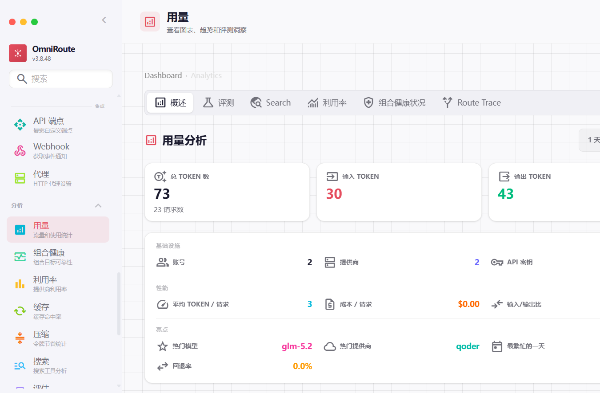
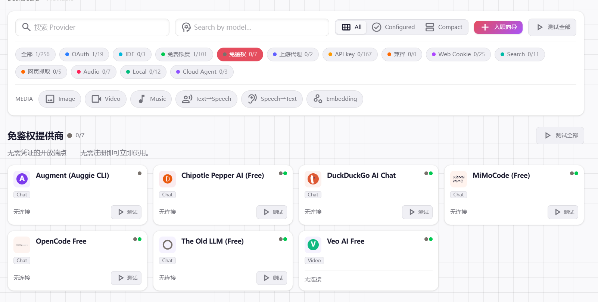
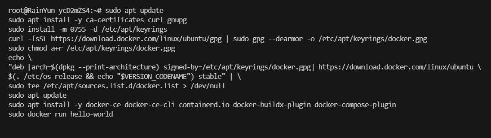
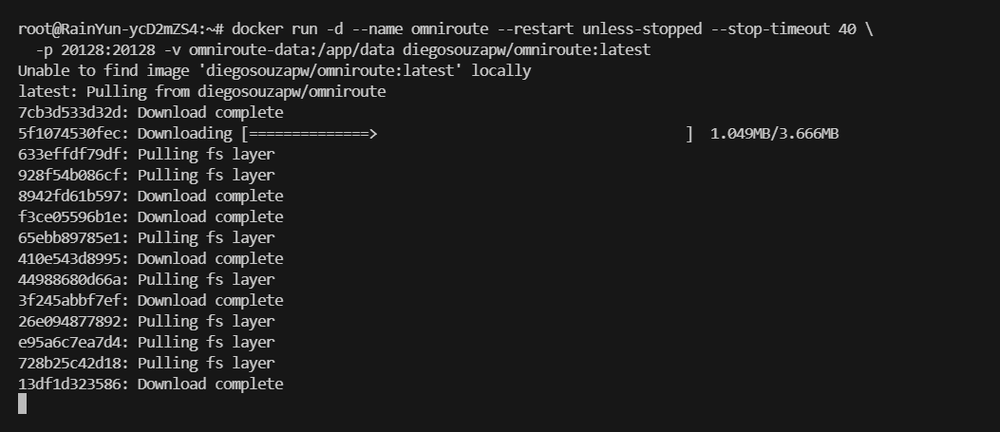
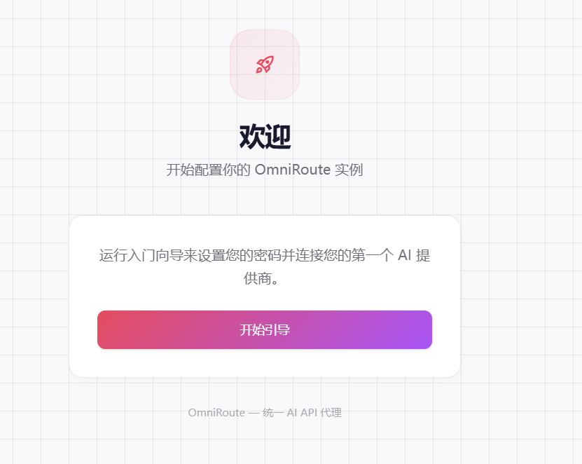
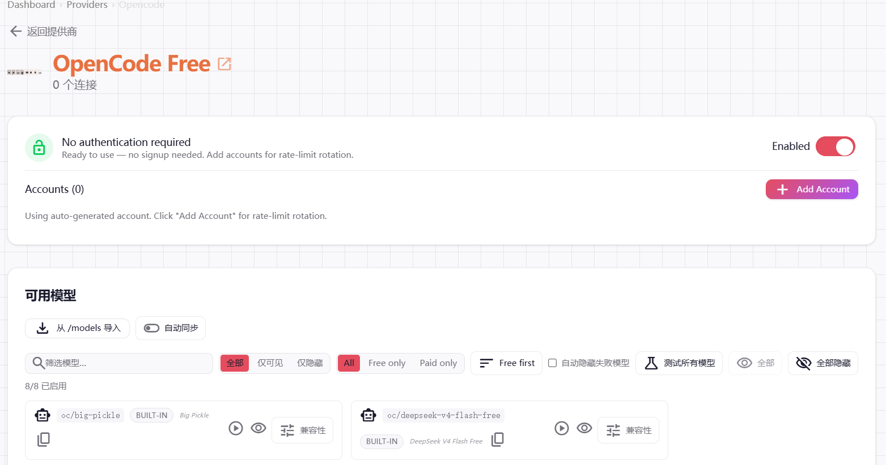
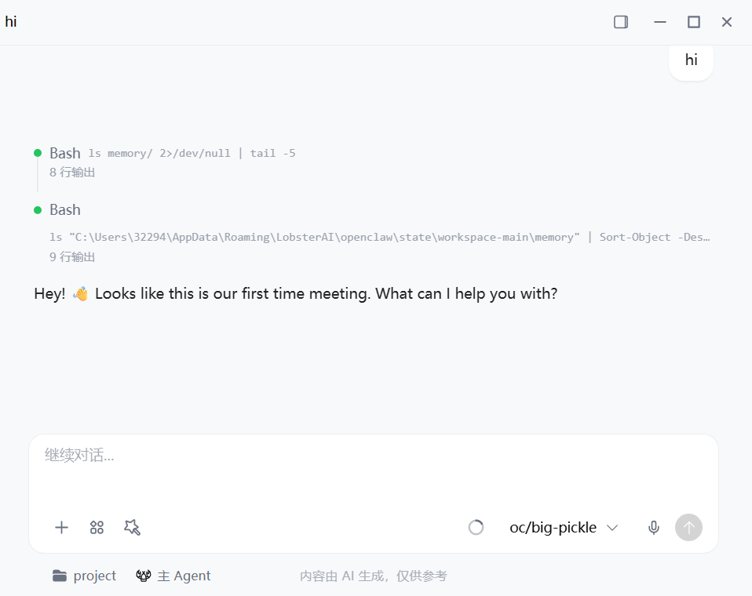

# OmniRoute

免费额度的路由网关，自动容灾切换，并用压缩引擎省下 15–95% 的 Token。

项目地址：https://github.com/diegosouzapw/OmniRoute/blob/main/docs/i18n/zh-CN/README.md



可以反代很多软件，例如反代 OpenCode 等都可以。



---

## 服务器推荐

腾讯云新加坡、硅谷、东京地区 **199 元/年**，可同价续费

| 配置 | 详情 |
|------|------|
| CPU | 2 核 |
| 内存 | 4 GB |
| 带宽 | 30 Mbps |
| 硬盘 | 60 GB SSD |
| 月流量 | 1.5 TB |

推荐首尔线路，系统选 Ubuntu 24

购买地址：https://curl.qcloud.com/oyWDLkRJ


---

## 部署教程

### 1. 安装 Docker

```bash
sudo apt update
sudo apt install -y ca-certificates curl gnupg
sudo install -m 0755 -d /etc/apt/keyrings
curl -fsSL https://download.docker.com/linux/ubuntu/gpg | sudo gpg --dearmor -o /etc/apt/keyrings/docker.gpg
sudo chmod a+r /etc/apt/keyrings/docker.gpg
echo \
"deb [arch=$(dpkg --print-architecture) signed-by=/etc/apt/keyrings/docker.gpg] https://download.docker.com/linux/ubuntu \
$(. /etc/os-release && echo "$VERSION_CODENAME") stable" | \
sudo tee /etc/apt/sources.list.d/docker.list > /dev/null
sudo apt update
sudo apt install -y docker-ce docker-ce-cli containerd.io docker-buildx-plugin docker-compose-plugin
sudo docker run hello-world
```



### 2. Docker 部署项目

```bash
docker run -d --name omniroute --restart unless-stopped --stop-timeout 40 \
  -p 20128:20128 -v omniroute-data:/app/data diegosouzapw/omniroute:latest
```



### 3. 访问服务

记得在服务器厂商控制台面板放通防火墙端口 20128

```
http://你的服务器IP:20128
```



### 4. 选择提供商

例如选择 OpenCode



### 5. 测试



| 参数 | 值 |
|------|----|
| 接口 | `http://你的服务器IP:20128/v1` |
| 模型 | `oc/big-pickle` |
